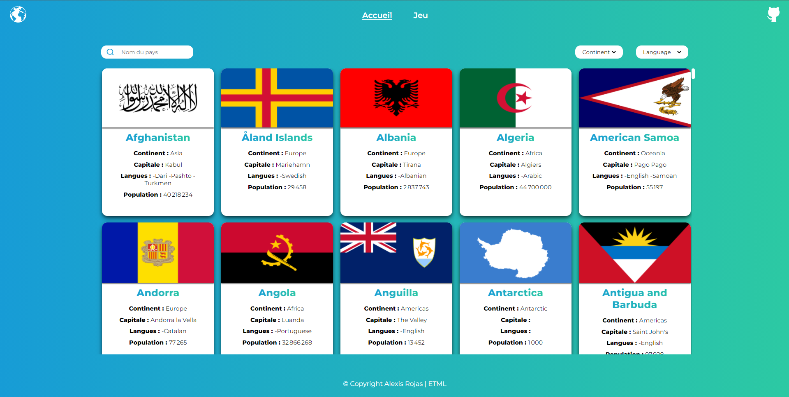
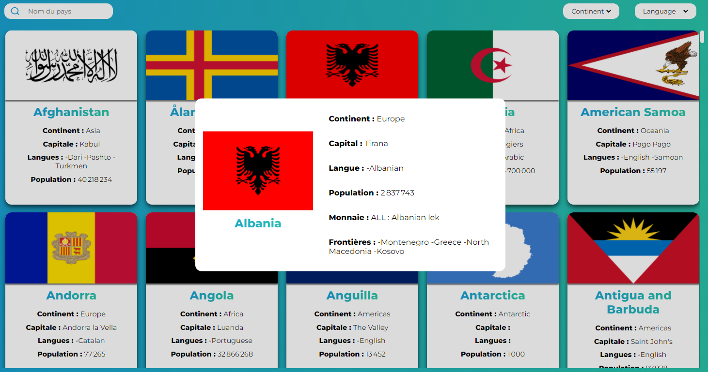
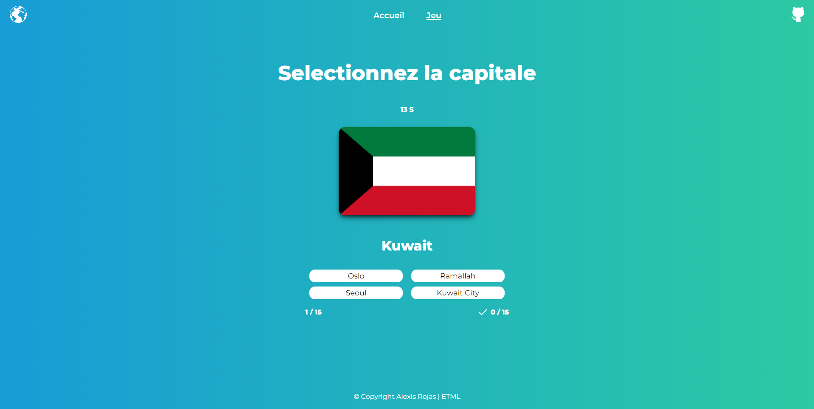
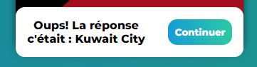

# Countries website

## 1. Page d'accueil

La page d'accueil affiche la liste de tous les pays ainsi
qu'une barre de recherche où on peut rechercher un pays
par son nom dans n'importe quelle langue.  
Il y a également deux listes déroulantes pour filtrer les résultats
par continent et par langue.

### 1.1 Modal détails du pays

Quand on clique sur le nom d'un pays, un modal est affiché contenant
plus d'informations du pays.

## 2. Jeu des capitales

Un jeu pour déviner les capitales est également présent.  
Il est accesible en appuyant sur le bouton "Jeu" de la barre de nav.

- Le nom ainsi que le drapeau du pays sont affichés
- 4 réponses sont proposées
- Il y a 15 secondes pour répondre
- Il y a 15 questions au total

### 2.1 Modal du jeu

Quand le joueur réponde mal une question, une alerte affiche la réponse correcte  
